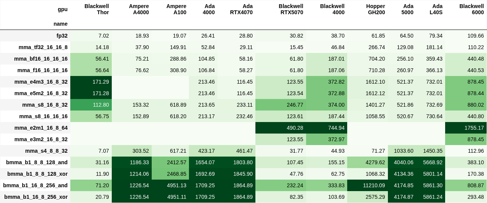
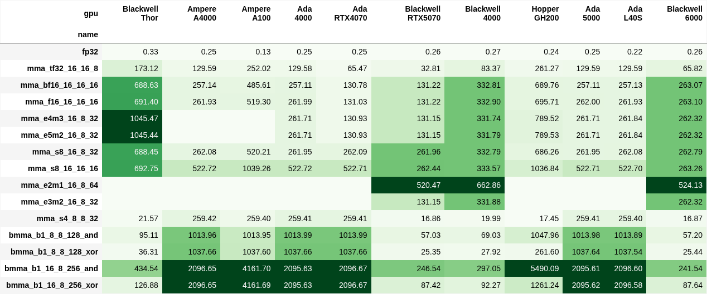

# CUDA Peak Performance Report

This auto-generated report presents benchmark results for the [cudapeak](https://github.com/astron-rd/cudapeak) FP32 and MMA synthetic performance benchmarks on various GPUs.

The benchmarks evaluate synthetic workloads designed to measure peak operations per second (OPs), providing insights into architectural efficiency and computational limits.

## Absolute performance
Measured in teraoperations per second (TOPs), showing raw computational throughput for various data types and MMA sizes.

<b>📊 Data table</b>

<table border="1" class="dataframe">
  <thead>
    <tr style="text-align: right;">
      <th>gpu</th>
      <th>Blackwell Thor</th>
      <th>Ampere A4000</th>
      <th>Ampere A100</th>
      <th>Ada 4000</th>
      <th>Ada RTX4070</th>
      <th>Blackwell RTX5070</th>
      <th>Blackwell 4000</th>
      <th>Hopper GH200</th>
      <th>Ada 5000</th>
      <th>Ada L40S</th>
      <th>Blackwell 6000</th>
    </tr>
    <tr>
      <th>name</th>
      <th></th>
      <th></th>
      <th></th>
      <th></th>
      <th></th>
      <th></th>
      <th></th>
      <th></th>
      <th></th>
      <th></th>
      <th></th>
    </tr>
  </thead>
  <tbody>
    <tr>
      <th>fp32</th>
      <td>7.01929</td>
      <td>18.930950</td>
      <td>19.067255</td>
      <td>26.407110</td>
      <td>28.797527</td>
      <td>30.819866</td>
      <td>38.7040</td>
      <td>61.853293</td>
      <td>64.498883</td>
      <td>79.3428</td>
      <td>109.655750</td>
    </tr>
    <tr>
      <th>mma_tf32_16_16_8</th>
      <td>14.18230</td>
      <td>37.903967</td>
      <td>149.914518</td>
      <td>52.844960</td>
      <td>29.114508</td>
      <td>15.454058</td>
      <td>46.8450</td>
      <td>266.736800</td>
      <td>129.080338</td>
      <td>181.1360</td>
      <td>110.215085</td>
    </tr>
    <tr>
      <th>mma_bf16_16_16_16</th>
      <td>56.41290</td>
      <td>75.212588</td>
      <td>288.862000</td>
      <td>104.852255</td>
      <td>58.160180</td>
      <td>61.804632</td>
      <td>187.0130</td>
      <td>704.198000</td>
      <td>256.103896</td>
      <td>359.4260</td>
      <td>440.483894</td>
    </tr>
    <tr>
      <th>mma_f16_16_16_16</th>
      <td>56.63970</td>
      <td>76.615314</td>
      <td>308.900588</td>
      <td>106.844700</td>
      <td>58.274648</td>
      <td>61.802681</td>
      <td>187.0590</td>
      <td>710.275867</td>
      <td>260.972078</td>
      <td>366.1300</td>
      <td>440.530013</td>
    </tr>
    <tr>
      <th>mma_e4m3_16_8_32</th>
      <td>171.29000</td>
      <td>0.000000</td>
      <td>0.000000</td>
      <td>213.455950</td>
      <td>116.452746</td>
      <td>123.545516</td>
      <td>372.8190</td>
      <td>1612.101333</td>
      <td>521.370130</td>
      <td>732.0090</td>
      <td>878.445664</td>
    </tr>
    <tr>
      <th>mma_e5m2_16_8_32</th>
      <td>171.28500</td>
      <td>0.000000</td>
      <td>0.000000</td>
      <td>213.455950</td>
      <td>116.452617</td>
      <td>123.544432</td>
      <td>372.8780</td>
      <td>1612.116000</td>
      <td>521.370130</td>
      <td>732.0150</td>
      <td>878.438458</td>
    </tr>
    <tr>
      <th>mma_s8_16_8_32</th>
      <td>112.79600</td>
      <td>153.317012</td>
      <td>618.888627</td>
      <td>213.654600</td>
      <td>233.112773</td>
      <td>246.765783</td>
      <td>374.0010</td>
      <td>1401.265067</td>
      <td>521.855844</td>
      <td>732.6910</td>
      <td>880.022351</td>
    </tr>
    <tr>
      <th>mma_s8_16_16_16</th>
      <td>56.75000</td>
      <td>152.894220</td>
      <td>618.199294</td>
      <td>213.170300</td>
      <td>232.464375</td>
      <td>123.608397</td>
      <td>187.4380</td>
      <td>1058.547600</td>
      <td>520.672468</td>
      <td>730.6400</td>
      <td>440.795196</td>
    </tr>
    <tr>
      <th>mma_e2m1_16_8_64</th>
      <td>0.00000</td>
      <td>0.000000</td>
      <td>0.000000</td>
      <td>0.000000</td>
      <td>0.000000</td>
      <td>490.279085</td>
      <td>744.9430</td>
      <td>0.000000</td>
      <td>0.000000</td>
      <td>0.0000</td>
      <td>1755.167636</td>
    </tr>
    <tr>
      <th>mma_e3m2_16_8_32</th>
      <td>0.00000</td>
      <td>0.000000</td>
      <td>0.000000</td>
      <td>0.000000</td>
      <td>0.000000</td>
      <td>123.546600</td>
      <td>372.9740</td>
      <td>0.000000</td>
      <td>0.000000</td>
      <td>0.0000</td>
      <td>878.454311</td>
    </tr>
    <tr>
      <th>mma_s4_8_8_32</th>
      <td>7.06834</td>
      <td>303.516571</td>
      <td>617.205843</td>
      <td>423.168000</td>
      <td>461.474063</td>
      <td>31.767964</td>
      <td>44.9338</td>
      <td>71.268413</td>
      <td>1033.597792</td>
      <td>1450.3500</td>
      <td>112.956561</td>
    </tr>
    <tr>
      <th>bmma_b1_8_8_128_and</th>
      <td>31.16420</td>
      <td>1186.334367</td>
      <td>2412.574510</td>
      <td>1654.073000</td>
      <td>1803.798047</td>
      <td>107.446707</td>
      <td>155.1510</td>
      <td>4279.616000</td>
      <td>4040.061039</td>
      <td>5668.9200</td>
      <td>383.101972</td>
    </tr>
    <tr>
      <th>bmma_b1_8_8_128_xor</th>
      <td>11.89660</td>
      <td>1214.064163</td>
      <td>2468.845490</td>
      <td>1692.686500</td>
      <td>1845.898828</td>
      <td>47.764211</td>
      <td>62.7494</td>
      <td>1068.321467</td>
      <td>4134.355844</td>
      <td>5801.1400</td>
      <td>170.378837</td>
    </tr>
    <tr>
      <th>bmma_b1_16_8_256_and</th>
      <td>71.19540</td>
      <td>1226.542041</td>
      <td>4951.127451</td>
      <td>1709.245500</td>
      <td>1864.886719</td>
      <td>232.242369</td>
      <td>333.8350</td>
      <td>11210.085333</td>
      <td>4174.846753</td>
      <td>5861.3000</td>
      <td>808.865310</td>
    </tr>
    <tr>
      <th>bmma_b1_16_8_256_xor</th>
      <td>20.78760</td>
      <td>1226.542041</td>
      <td>4951.109020</td>
      <td>1709.245500</td>
      <td>1864.886719</td>
      <td>82.348065</td>
      <td>103.6910</td>
      <td>2575.290667</td>
      <td>4174.868831</td>
      <td>5861.2400</td>
      <td>293.480101</td>
    </tr>
  </tbody>
</table>

## Operations per cycle
Operations per cycle, showing how performance scales across different data types.

<b>📊 Data table</b>

<table border="1" class="dataframe">
  <thead>
    <tr style="text-align: right;">
      <th>gpu</th>
      <th>Blackwell Thor</th>
      <th>Ampere A4000</th>
      <th>Ampere A100</th>
      <th>Ada 4000</th>
      <th>Ada RTX4070</th>
      <th>Blackwell RTX5070</th>
      <th>Blackwell 4000</th>
      <th>Hopper GH200</th>
      <th>Ada 5000</th>
      <th>Ada L40S</th>
      <th>Blackwell 6000</th>
    </tr>
    <tr>
      <th>name</th>
      <th></th>
      <th></th>
      <th></th>
      <th></th>
      <th></th>
      <th></th>
      <th></th>
      <th></th>
      <th></th>
      <th></th>
      <th></th>
    </tr>
  </thead>
  <tbody>
    <tr>
      <th>fp32</th>
      <td>0.334705</td>
      <td>0.252817</td>
      <td>0.125212</td>
      <td>0.252942</td>
      <td>0.252943</td>
      <td>0.255605</td>
      <td>0.269058</td>
      <td>0.236659</td>
      <td>0.252937</td>
      <td>0.221727</td>
      <td>0.255822</td>
    </tr>
    <tr>
      <th>mma_tf32_16_16_8</th>
      <td>173.123119</td>
      <td>129.586213</td>
      <td>252.023355</td>
      <td>129.581511</td>
      <td>65.466087</td>
      <td>32.811164</td>
      <td>83.36684</td>
      <td>261.266532</td>
      <td>129.586535</td>
      <td>129.585334</td>
      <td>65.824612</td>
    </tr>
    <tr>
      <th>mma_bf16_16_16_16</th>
      <td>688.631406</td>
      <td>257.137052</td>
      <td>485.609877</td>
      <td>257.108978</td>
      <td>130.777391</td>
      <td>131.220026</td>
      <td>332.814237</td>
      <td>689.756229</td>
      <td>257.108225</td>
      <td>257.13463</td>
      <td>263.073621</td>
    </tr>
    <tr>
      <th>mma_f16_16_16_16</th>
      <td>691.39995</td>
      <td>261.932698</td>
      <td>519.297023</td>
      <td>261.994667</td>
      <td>131.034783</td>
      <td>131.215883</td>
      <td>332.8961</td>
      <td>695.70945</td>
      <td>261.995498</td>
      <td>261.930695</td>
      <td>263.101165</td>
    </tr>
    <tr>
      <th>mma_e4m3_16_8_32</th>
      <td>1045.467203</td>
      <td>0.0</td>
      <td>0.0</td>
      <td>261.708444</td>
      <td>130.926232</td>
      <td>131.152352</td>
      <td>331.740229</td>
      <td>789.52009</td>
      <td>261.707359</td>
      <td>261.840912</td>
      <td>262.320467</td>
    </tr>
    <tr>
      <th>mma_e5m2_16_8_32</th>
      <td>1045.436686</td>
      <td>0.0</td>
      <td>0.0</td>
      <td>261.708444</td>
      <td>130.926087</td>
      <td>131.151201</td>
      <td>331.792729</td>
      <td>789.527273</td>
      <td>261.707359</td>
      <td>261.843058</td>
      <td>262.318315</td>
    </tr>
    <tr>
      <th>mma_s8_16_8_32</th>
      <td>688.449522</td>
      <td>262.080363</td>
      <td>520.211087</td>
      <td>261.952</td>
      <td>262.085507</td>
      <td>261.95943</td>
      <td>332.791992</td>
      <td>686.263883</td>
      <td>261.951169</td>
      <td>262.084865</td>
      <td>262.791296</td>
    </tr>
    <tr>
      <th>mma_s8_16_16_16</th>
      <td>692.746381</td>
      <td>522.715283</td>
      <td>1039.263326</td>
      <td>522.716444</td>
      <td>522.713043</td>
      <td>262.43821</td>
      <td>333.57058</td>
      <td>1036.838788</td>
      <td>522.71432</td>
      <td>522.702437</td>
      <td>263.259542</td>
    </tr>
    <tr>
      <th>mma_e2m1_16_8_64</th>
      <td>0.0</td>
      <td>0.0</td>
      <td>0.0</td>
      <td>0.0</td>
      <td>0.0</td>
      <td>520.46612</td>
      <td>662.862037</td>
      <td>0.0</td>
      <td>0.0</td>
      <td>0.0</td>
      <td>524.126207</td>
    </tr>
    <tr>
      <th>mma_e3m2_16_8_32</th>
      <td>0.0</td>
      <td>0.0</td>
      <td>0.0</td>
      <td>0.0</td>
      <td>0.0</td>
      <td>131.153503</td>
      <td>331.878151</td>
      <td>0.0</td>
      <td>0.0</td>
      <td>0.0</td>
      <td>262.323049</td>
    </tr>
    <tr>
      <th>mma_s4_8_8_32</th>
      <td>21.57078</td>
      <td>259.415873</td>
      <td>259.398305</td>
      <td>259.413333</td>
      <td>259.414493</td>
      <td>16.861977</td>
      <td>19.991402</td>
      <td>17.451708</td>
      <td>259.412779</td>
      <td>259.396378</td>
      <td>16.865481</td>
    </tr>
    <tr>
      <th>bmma_b1_8_8_128_and</th>
      <td>95.105228</td>
      <td>1013.960998</td>
      <td>1013.953038</td>
      <td>1013.991111</td>
      <td>1013.992754</td>
      <td>57.031161</td>
      <td>69.027904</td>
      <td>1047.96229</td>
      <td>1013.976104</td>
      <td>1013.891348</td>
      <td>57.200742</td>
    </tr>
    <tr>
      <th>bmma_b1_8_8_128_xor</th>
      <td>36.305403</td>
      <td>1037.661678</td>
      <td>1037.602518</td>
      <td>1037.662222</td>
      <td>1037.65942</td>
      <td>25.352554</td>
      <td>27.917703</td>
      <td>261.603053</td>
      <td>1037.642251</td>
      <td>1037.539012</td>
      <td>25.439169</td>
    </tr>
    <tr>
      <th>bmma_b1_16_8_256_and</th>
      <td>434.540579</td>
      <td>2096.653061</td>
      <td>4161.704188</td>
      <td>2095.626667</td>
      <td>2096.666667</td>
      <td>246.541793</td>
      <td>297.051651</td>
      <td>5490.093827</td>
      <td>2095.609351</td>
      <td>2096.597362</td>
      <td>241.542459</td>
    </tr>
    <tr>
      <th>bmma_b1_16_8_256_xor</th>
      <td>126.876957</td>
      <td>2096.653061</td>
      <td>4161.688695</td>
      <td>2095.626667</td>
      <td>2096.666667</td>
      <td>87.418328</td>
      <td>92.265888</td>
      <td>1261.238159</td>
      <td>2095.620433</td>
      <td>2096.5759</td>
      <td>87.638701</td>
    </tr>
  </tbody>
</table>

*Report generated on 2025-12-16 11:10 UTC*
